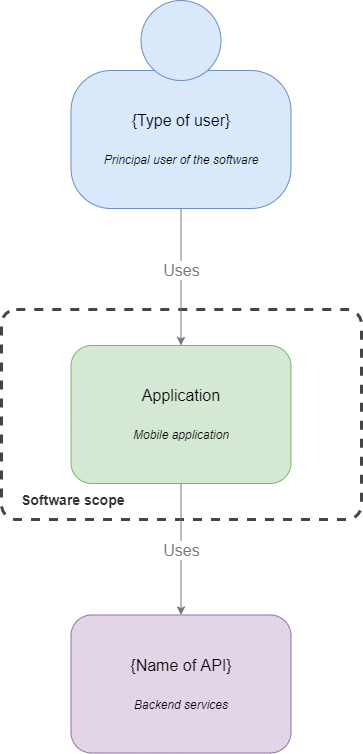
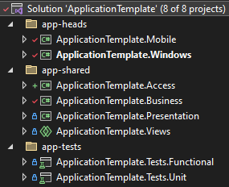

# Software Architecture

## Context

_[Insert context description here]_

_[Create this diagram from the [architecture file](diagrams/architecture.drawio) (context tab) using [Draw.io](https://www.draw.io/)]_

---

## Functional Overview

This is a summary of the functionalities available to the user.

_[Insert list of functionalities here]_

---

## Application Structure

_[Insert structure description here]_

_[Create this diagram from the [architecture file](diagrams/architecture.drawio) (structure tab) using [Draw.io](https://www.draw.io/)]_

---

## Solution Structure

The application solution is divided in 2 main areas.
- `app-heads` contains the _runnable_ heads.
- `app-shared` contains the shared code used by the heads.
  - It's divided per application layer.
  - You can only put platform-specific code (things like `#if __IOS__`) in the Views layer.
  The other layers are `.Net Standard 2.0` libraries that are platform agnostic.

### Client (DAL)
The _data access layer_ is where you would put external dependencies such as API endpoints and local storage.
This is where you put serializable entities.

### Business
The business layer is where you put your business services and entities that manipulate data from the client layer.
Entities from the business layer are usually immutable and they don't need to be serializable.

### Presentation
The presentation layer implements the user experience (UX).
It contains all the ViewModels, navigation, dialogs, and most of the configuration.

### View
The view layer implements the user interface (UI).
It contains all the XAML, converters, templates, styles, assets, and other UI resources.
This layer also contains platform-specific implementations of services.
For that reason, it also contains a good portion of the configuration.

---

## Topics

### T01 - Material Theme

This app uses [Uno.Themes](https://github.com/unoplatform/Uno.Themes) resources.

Resources from **Uno.Material** are used for the following:
- Color system
- Typography (TextBlock styles)
- Controls styles

### T02 - Caching

_[Insert description of the caching here]_

### T03 - Offline

_[Insert description of the offline here]_

### T04 - Security

_[Insert description of the security here]_

### T05 - [Name of topic]

_[Insert description of topic here]_
